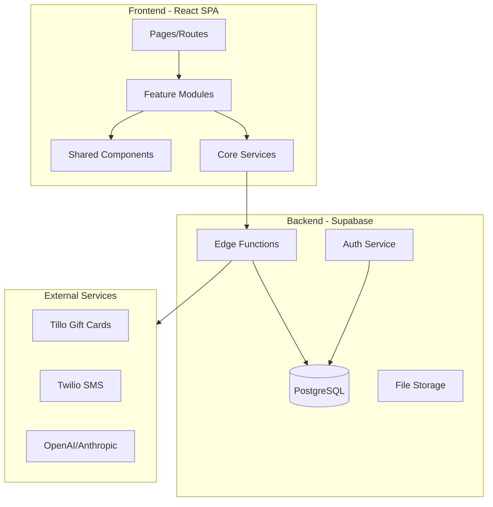
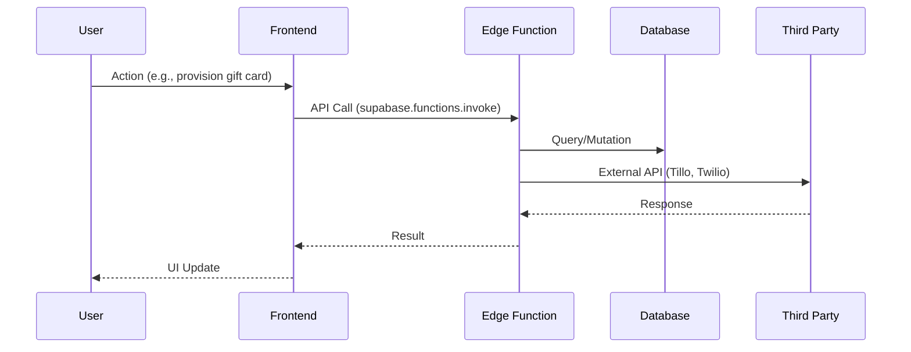

# Mobul Codebase Map

> Complete technical reference for the Mobul direct mail marketing platform.

## Quick Links

- [Architecture Overview](#architecture-overview)
- [Tech Stack](#tech-stack)
- [Folder Structure](#folder-structure)
- [Features](#features)
- [Backend (Supabase)](#backend-supabase)
- [Getting Started](#getting-started)
- [Common Patterns](#common-patterns)

---

## Architecture Overview



### Data Flow



---

## Tech Stack

| Layer | Technology | Version | Purpose |
|-------|------------|---------|---------|
| **Frontend** | React | 18.x | UI Framework |
| | TypeScript | 5.8 | Type Safety |
| | Vite | 5.4 | Build Tool |
| | TanStack Query | 5.x | Server State |
| | React Hook Form | 7.x | Form Management |
| | Zod | 3.x | Validation |
| | Tailwind CSS | 3.4 | Styling |
| | Shadcn UI | Latest | Component Library |
| | Framer Motion | 11.x | Animations |
| **Backend** | Supabase | Latest | BaaS Platform |
| | PostgreSQL | 15.x | Database |
| | Deno | Latest | Edge Functions |
| **Integrations** | Tillo | API v2 | Gift Card Provider |
| | Twilio | Latest | SMS/Voice |
| | OpenAI/Anthropic | Latest | AI Generation |

---

## Folder Structure

```
mobul/
├── src/                      # Frontend source code
│   ├── app/                  # App entry, providers, routing
│   ├── core/                 # Core services (auth, api, services)
│   ├── features/             # Feature modules (22 features)
│   ├── shared/               # Shared components, hooks, utils
│   ├── pages/                # Route page components
│   └── types/                # TypeScript type definitions
│
├── supabase/                 # Backend
│   ├── functions/            # Edge functions (91 functions)
│   │   └── _shared/          # Shared edge function modules
│   └── migrations/           # Database migrations
│
├── scripts/                  # Development & deployment scripts
│   ├── sql/                  # SQL utilities and seed data
│   └── seed-data/            # TypeScript seed data generators
│
├── docs/                     # Documentation
│   └── operations/           # Operational runbooks
│
├── public/                   # Static assets
└── Knowledgebase/            # Business documentation
```

---

## Features

The application is organized into 22 feature modules in `src/features/`:

| Feature | Purpose | Key Files |
|---------|---------|-----------|
| **activity** | Unified audit logging | `ActivityTable`, `useActivityLogs` |
| **admin** | Platform administration | `MVPDataSeeder`, demo generators |
| **agency** | Agency-level management | `AgencyDashboard`, `AgencyTwilioSettings` |
| **agent** | Call center agent UI | `CodeApprovalPanel`, `CallVerificationDialog` |
| **ai-designer** | AI landing page builder | `AILandingPageChat`, `LiveCodePreview` |
| **analytics** | Reporting & ROI | `CampaignROICalculator`, `useDashboardData` |
| **audiences** | Audience/recipient management | `AudienceImportTab`, `FileUploadZone` |
| **billing** | Credit management | `useCreditManagement` |
| **call-center** | Redemption workflows | `CallCenterRedemptionPanelV2`, `useRedemptionWorkflow` |
| **campaigns** | Campaign management | `CreateCampaignWizard`, `useCampaignConditions` |
| **contacts** | CRM & contact lists | `ContactsTable`, `SmartCSVImporter` |
| **dashboard** | Main dashboard | `DrPhillipChat`, `GiftCardSummaryCard` |
| **designer** | Mail/landing page designer | `DesignerCanvas`, `useDesignerAI` |
| **documentation** | In-app docs | `DocumentationContent`, `MarkdownRenderer` |
| **email** | Email templates | `GiftCardDeliveryEmail`, `WelcomeEmail` |
| **forms** | Form builder | `FormBuilder`, `GiftCardReveal` |
| **gift-cards** | Gift card system | `ClientMarketplace`, `useGiftCardProvisioning` |
| **landing-pages** | Landing page management | `CodeEntryForm`, exporters |
| **mail-designer** | Mail piece designer | `MailGrid`, `MailPreviewRenderer` |
| **marketing** | Email/SMS marketing | `BroadcastBuilderWizard`, `AutomationBuilder` |
| **onboarding** | User onboarding | `OnboardingChecklist` |
| **settings** | Platform settings | `TwilioConfigForm`, `useAPIKeys` |

---

## Backend (Supabase)

### Edge Functions (91 functions)

Organized by category:

| Category | Count | Examples |
|----------|-------|----------|
| **Gift Cards** | 15 | `provision-gift-card-unified`, `revoke-gift-card` |
| **Campaigns** | 12 | `evaluate-conditions`, `validate-campaign-budget` |
| **Redemption** | 8 | `validate-redemption-code`, `redeem-customer-code` |
| **SMS/Email** | 10 | `send-gift-card-sms`, `send-marketing-email` |
| **Twilio** | 7 | `configure-twilio-webhooks`, `fetch-twilio-numbers` |
| **Import/Export** | 8 | `import-audience`, `export-database` |
| **Marketing** | 5 | `trigger-marketing-automation` |
| **AI** | 5 | `ai-landing-page-generate`, `ai-design-chat` |
| **Webhooks** | 6 | `trigger-webhook`, `zapier-incoming-webhook` |
| **Other** | 15 | Various utilities |

### Shared Modules (`_shared/`)

| Module | Purpose |
|--------|---------|
| `api-gateway.ts` | Request/response handling, auth, validation |
| `sms-provider.ts` | Unified SMS abstraction (4 providers) |
| `twilio-hierarchy.ts` | Hierarchical Twilio credential resolution |
| `activity-logger.ts` | Structured activity logging |
| `tillo-client.ts` | Tillo gift card API client |
| `business-rules/` | Campaign, credit, organization rules |

### SMS Provider Hierarchy

```
1. NotificationAPI (primary)
2. Infobip (fallback)
3. Twilio (hierarchical: Client → Agency → Admin)
4. EZTexting (legacy fallback)
```

---

## Getting Started

### Prerequisites

- Node.js 18+
- npm or pnpm
- Supabase CLI
- PowerShell (Windows) or Bash (Mac/Linux)

### Local Development

```bash
# Install dependencies
npm install

# Start development server
npm run dev

# Run Supabase locally
supabase start

# Deploy edge functions
npm run deploy:functions
```

### Environment Variables

Copy `.env.example` to `.env` and configure:

```env
VITE_SUPABASE_URL=your_supabase_url
VITE_SUPABASE_ANON_KEY=your_anon_key
```

See `docs/ENVIRONMENT_SETUP.md` for full configuration.

---

## Common Patterns

### API Calls

```typescript
// Always use edge functions for business logic
const { data, error } = await supabase.functions.invoke('function-name', {
  body: { param1, param2 }
});
if (error) throw error;
```

### Data Fetching

```typescript
// Use TanStack Query for server state
export function useFeatureData(id: string) {
  return useQuery({
    queryKey: ['feature', id],
    queryFn: () => fetchFeatureData(id),
    staleTime: 5 * 60 * 1000,
  });
}
```

### Component Structure

```typescript
// Keep components focused, delegate to hooks
export function FeatureCard({ data }: FeatureCardProps) {
  const { mutate } = useFeatureMutation();
  return <Card>...</Card>;
}
```

### Feature Module Structure

```
feature-name/
├── components/       # React components
├── hooks/            # Custom hooks
├── types/            # TypeScript types
├── utils/            # Utilities
└── index.ts          # Public exports
```

---

## Key Directories

| Path | Description |
|------|-------------|
| `src/core/auth/` | Authentication, roles, permissions |
| `src/core/api/` | API client, error handling |
| `src/shared/components/ui/` | Shadcn UI components |
| `src/shared/hooks/` | Shared React hooks |
| `src/shared/utils/` | Utility functions |
| `supabase/functions/_shared/` | Edge function shared code |

---

## Related Documentation

- [Environment Setup](docs/ENVIRONMENT_SETUP.md)
- [Deployment Runbook](docs/DEPLOYMENT_RUNBOOK.md)
- [OAuth Setup](docs/OAUTH_SETUP.md)
- [Backup Procedures](docs/operations/BACKUP_PROCEDURES.md)
- [Disaster Recovery](docs/operations/DISASTER_RECOVERY.md)
- [Platform Dictionary](Knowledgebase/PLATFORM_DICTIONARY.md)

---

## Statistics

- **Feature Modules:** 22
- **Total Source Files:** ~900
- **Edge Functions:** 91
- **Database Tables:** 50+
- **Type Definitions:** 14 files
- **Shared Components:** 80+
